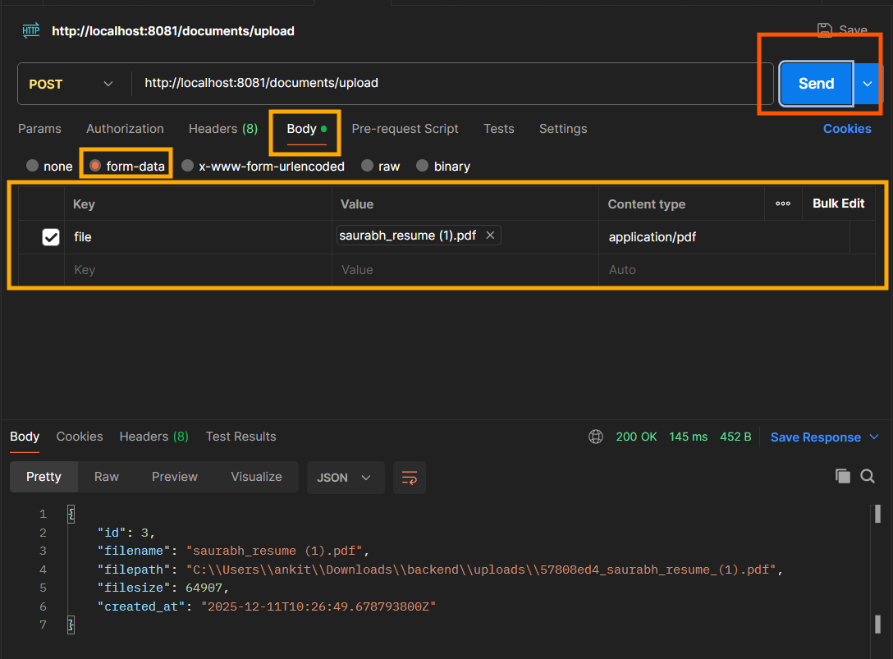
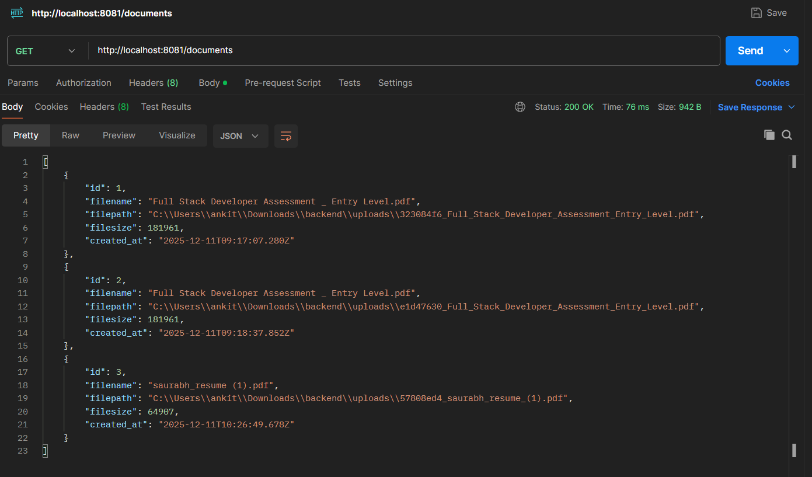
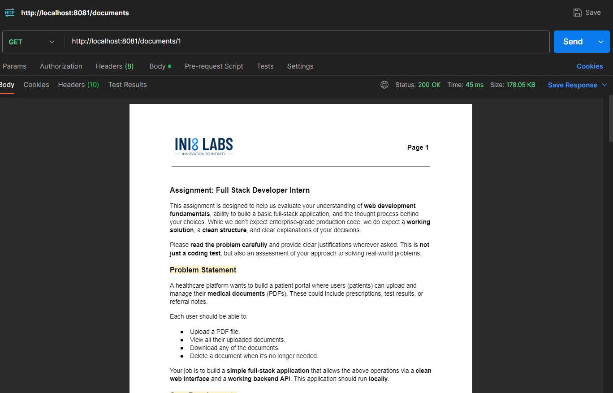
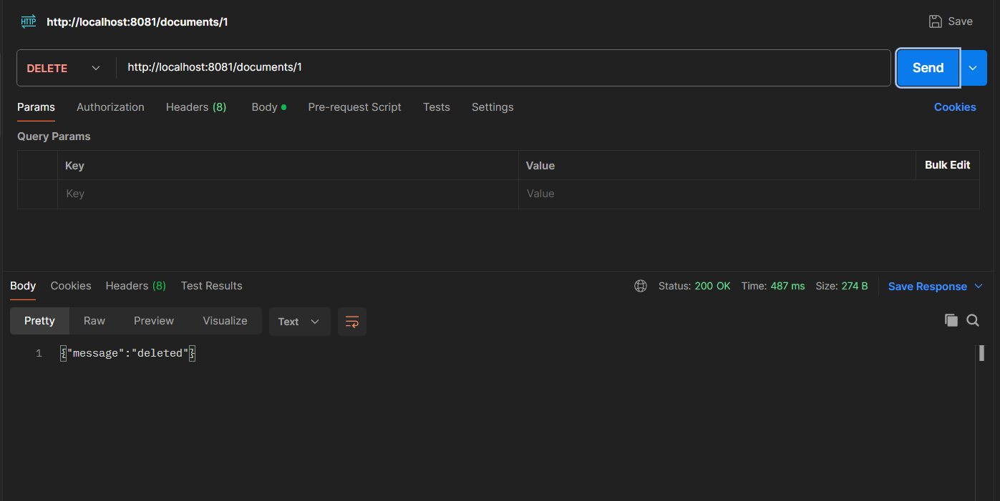

# Healthcare Document Portal — Backend (Spring Boot + SQLite)

This is the backend for the **Healthcare Document Portal**.  
It is built using **Spring Boot**, **Spring Web**, **Spring Data JPA**, and **SQLite**.  
It provides REST APIs to upload, list, download, and delete medical documents.

---

## Overview

Backend receives the document from frontend, validates it, saves it into the `uploads/` folder,  
and stores metadata inside the SQLite database.

Main features:

- Upload PDF document
- Validate file format and size
- Store real file in uploads directory
- Save metadata in SQLite
- List all documents
- Download specific document
- Delete document
- Exception handling

---

## Assumptions

- Maximum allowed file size: **10 MB**
- Only **PDF** files are accepted
- Server runs on port **8081**
- No authentication required
- Upload directory auto-created (in backend directory)
- SQLite database auto-created (in backend directory)

---

## Setup and Run Locally

### **Prerequisites**
Install:

- **Java 21**
- **Spring Boot 3.2+**
- **SQLite3 (CLI optional)**
- **Postman** (API testing)

---
## **1️⃣ Open / Clone project or download backend folder**
## 2️⃣ Run using IntelliJ IDEA

1. Open project(backend folder) in IntelliJ
2. Let Maven import dependencies
3. Run the main class: **HealthcarePortalApplication.java**
4. Application starts on:
   👉 http://localhost:8081 (port can be changed in application.properties file by changing server.port value)

[uploads folder](#upload-directory-important) and [SQLite DB](#sqlite-database-databasedb) will auto-create.
## 3️⃣ Run using Command Line

### Build:

```bash
mvn clean install
```

### Run:

```bash
mvn spring-boot:run
```

---

## API Endpoints, Functionality & Testing using Postman

### 1️⃣ Upload Document

```http
POST /documents/upload
Content-Type: application/pdf
```

**Functionality:**
* ✔ Validates PDF
* ✔ Validates size ≤ 10 MB
* ✔ Stores file + metadata
* ✔ Returns document info or error message if information is not as expected.

### Test using Postman

1. Open **Postman**
2. Create a **POST** request: http://localhost:8081/documents/upload
3. Go to the **Body** tab
4. Select **form-data**
5. Add a field:

| Key  | Value           | Content type      |
|------|-----------------|-------------------|
| file | Upload you file | *applicatoin/pdf* |
|      |                 |                   |
6. Click **Send**

**Response:**

```json
{
   "id": 3,
   "filename": "saurabh_resume (1).pdf",
   "filepath": "C:\\Users\\ankit\\Downloads\\backend\\uploads\\57808ed4_saurabh_resume_(1).pdf",
   "filesize": 64907,
   "created_at": "2025-12-11T10:26:49.678793800Z"
}
```


---

### 2️⃣ Get All Documents
```http
GET /documents
```
**Functionality:**
* ✔ Returns list of all stored documents if present.
---
### Test using Postman

1. Open **Postman**
2. Create a **POST** request: http://localhost:8081/documents
3. Click **Send**

**Response:**
List of all documents, if no document present then empty list.




### 3️⃣ Download Document

```http
GET /documents/{id}
```

**Functionality:**
* ✔ Sends file as download
* ✔ 404 if file or ID not found
---
### Test using Postman

1. Open **Postman**
2. Create a **GET** request: http://localhost:8081/documents/{id}
3. Click **Send**

**Response:**
Document pdf if present else not found error.



### 4️⃣ Delete Document

```http
DELETE /documents/{id}
```

**Functionality:**
* ✔ Deletes file from uploads folder
* ✔ Removes entry from SQLite
* ✔ Returns success or 404
---
### Test using Postman

1. Open **Postman**
2. Create a **DELETE** request: http://localhost:8081/documents/{id}
3. Click **Send**

**Response:**
Delete message if success otherwise error message.



## Upload Directory (Important)

Your backend stores uploaded files in:

```
uploads/
```

### Behavior:
* Folder is auto-created when the application starts
* All uploaded files go inside this folder
* File name contains a short UUID for uniqueness
* Example stored file:

```
uploads/3fa4c2d1_file_name.pdf
```

### If you want a different location:

Update `application.properties`:

```properties
app.upload.dir=/path/to/your/upload-folder
```

---

## SQLite Database (`database.db`)

Backend uses SQLite to store metadata about uploaded documents.

### Database file:

```
database.db
```

This file is auto-created when the application runs for the first time.

### Configuration in `application.properties`:

## Database Schema

### Documents Table

```sql
CREATE TABLE documents (
    id INTEGER PRIMARY KEY AUTOINCREMENT,
    filename VARCHAR(255) NOT NULL,
    filepath VARCHAR(255) NOT NULL,
    filesize BIGINT NOT NULL,
    created_at TIMESTAMP DEFAULT CURRENT_TIMESTAMP
);
```

---

## How to Check SQLite Data Using CLI

### 1️⃣ Open SQLite shell:

```bash
sqlite3
```

### 2️⃣ Open the project database:

```sql
.open database.db
```

### 3️⃣ View tables:

```sql
.tables
```

You will see:

```
documents
```

### 4️⃣ View all uploaded file records:

```sql
SELECT * FROM documents;
```

### 5️⃣ Exit SQLite:

```sql
.exit
```
---

## Future Scope & Improvements

### Storage & Performance
* File versioning
* Soft delete (Recycle Bin)
* Cloud storage support (AWS S3 / Azure)
* File compression
* Caching mechanism

### Security & Compliance
* Role-based authentication
* Encryption at rest
* Audit logging
* Rate limiting

### Monitoring & Operations
* Global logging and monitoring
* Health check endpoints
* Metrics and analytics
* Error tracking
* Performance monitoring

---

